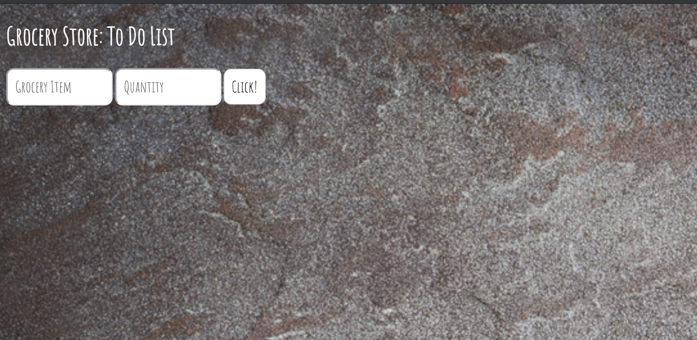

# expressPrevious
## This is an express application for a To-Do List.

## Tech Used
- HTML
- Javascript
- CSS
- Node.js

## App directions
- 1. Open Terminal
- 2. Run node server.js
- 3. Enter localhost:3000 within the browser.
